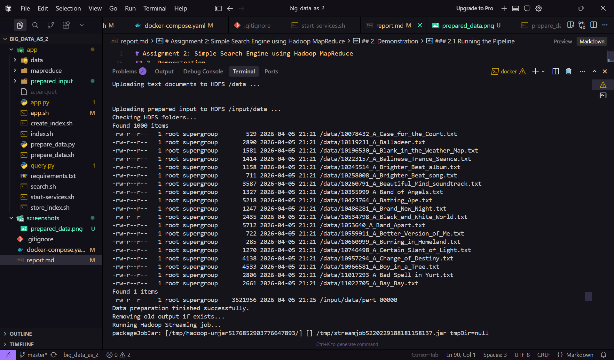
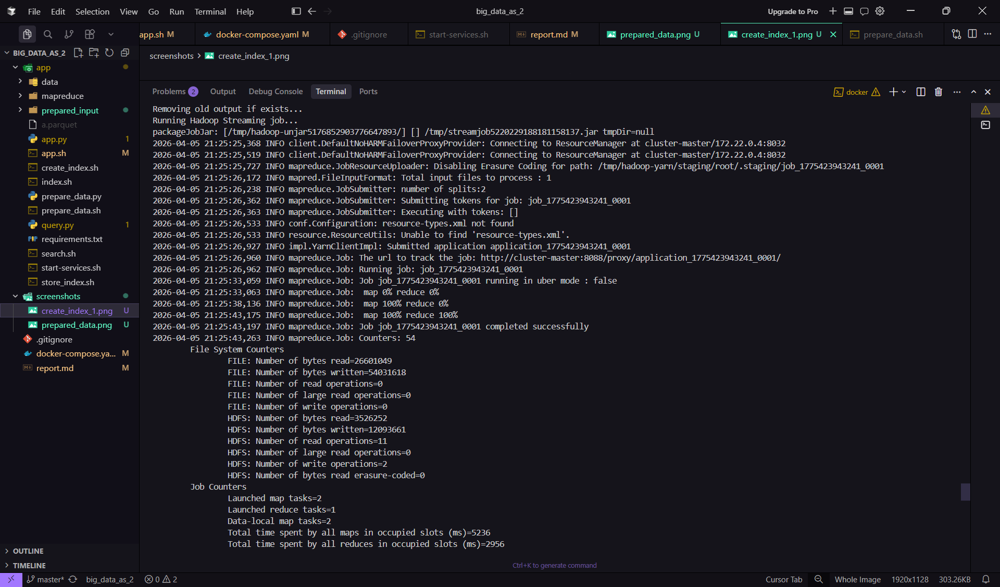
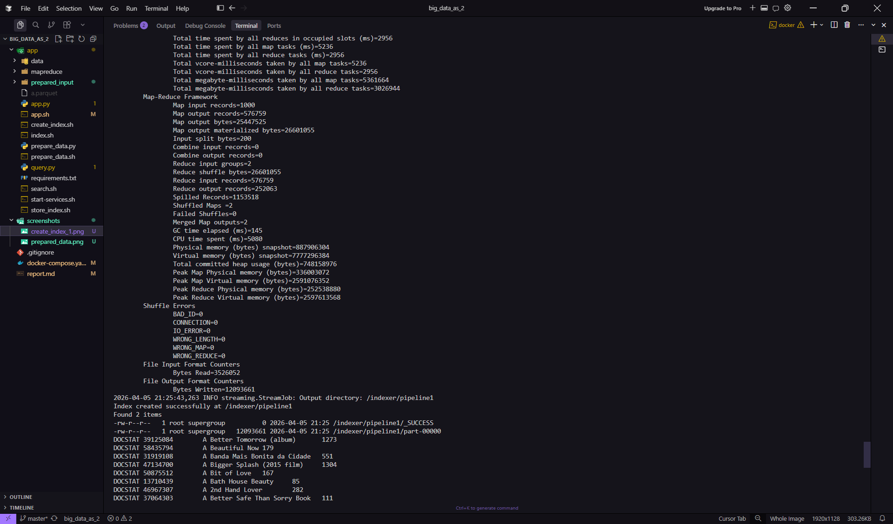
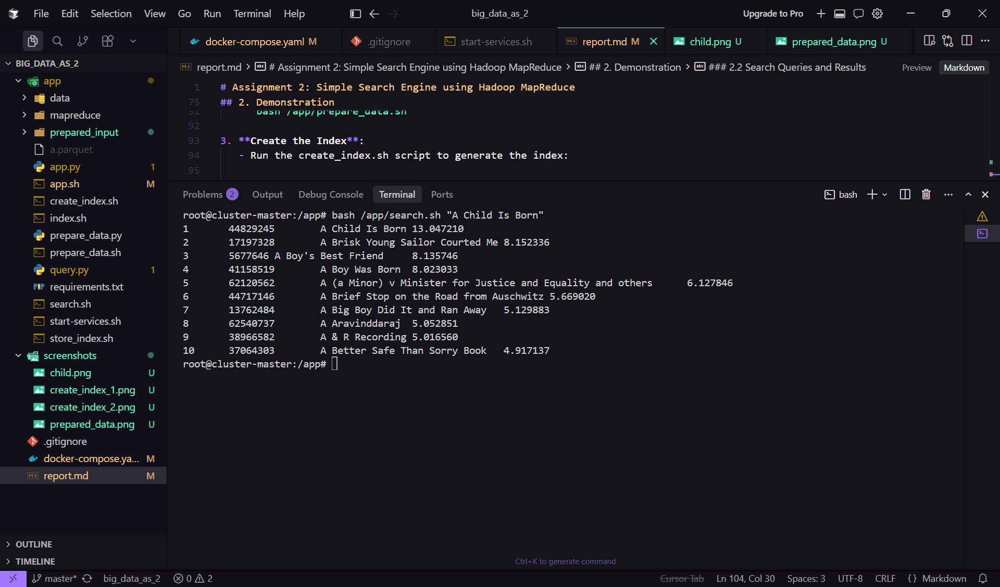
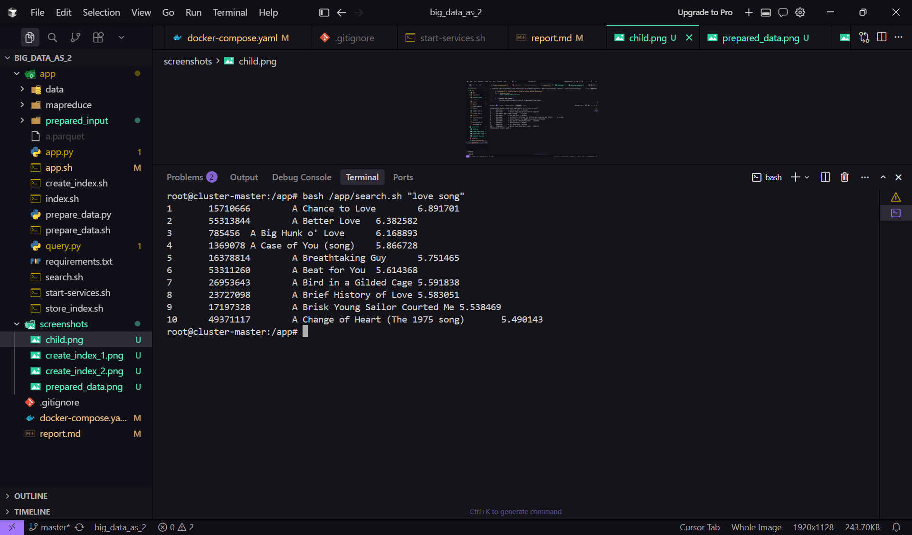
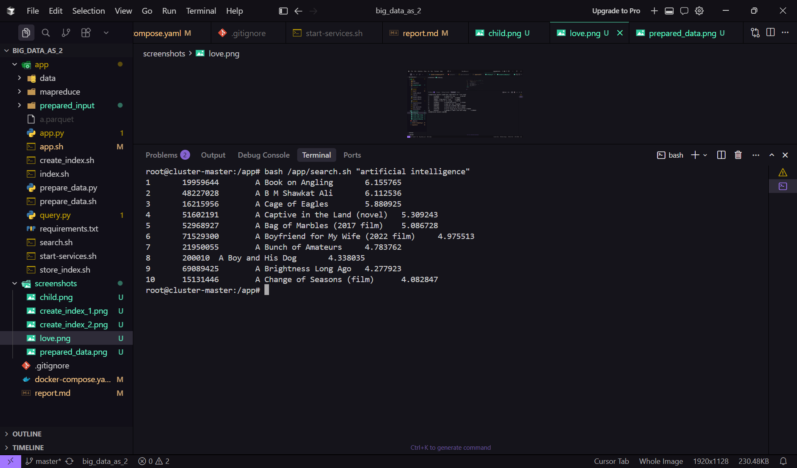

# Assignment 2: Simple Search Engine using Hadoop MapReduce

**Author**: Maksimov Ilya 
**Repository**: https://github.com/MaximovIlya/big_data_2

## 1. Methodology

### 1.1 Data Preparation

To prepare the data for indexing, I followed these steps:

1. **Input data loading**: 
   - I retrieved a set of text documents from a local directory and uploaded them into HDFS.
   - The documents were processed and split into smaller chunks to be indexed.
   
2. **Data Preprocessing**:
   - The `prepare_data.sh` script was used to run the `prepare_data.py` script, which converts raw text data into a format suitable for indexing in Hadoop.
   - The necessary directories were created in HDFS for storing intermediate results, such as the Parquet file and prepared input files.
   
3. **Data Verification**:
   - After running the preparation scripts, I verified that the files were correctly uploaded to HDFS using `hdfs dfs -ls` commands.
   - The Parquet file was loaded into HDFS for indexing purposes.
   
4. **Environment Setup**:
   - Apache Hadoop was used for managing the data and the MapReduce jobs.
   - Apache Spark was also used for data manipulation before indexing.

---

### 1.2 Indexing Process

1. **Mapper & Reducer Setup**:
   - The `mapper1.py` and `reducer1.py` scripts were implemented to process the text documents and build an index.
   - The Mapper takes input text, splits it into words, and emits key-value pairs (`word -> document_id`).
   - The Reducer aggregates the document occurrences and builds a frequency table for each word in the corpus.

2. **Hadoop Streaming Job**:
   - I used the Hadoop Streaming API to run the MapReduce job. The input files were loaded from HDFS, processed by the mapper and reducer, and the results were stored back in HDFS.
   - The output of the MapReduce job was stored in the `/indexer/pipeline1` directory in HDFS.

3. **Storing Index in Cassandra**:
   - After indexing, the resulting data was stored in Cassandra for efficient retrieval during the search phase.
   - The `store_index.sh` script was used to save the indexed data in Cassandra's tables.

4. **Pipeline Execution**:
   - The complete pipeline was automated using shell scripts (`prepare_data.sh`, `create_index.sh`, `store_index.sh`), which were chained together to perform the entire process from data preparation to indexing.

---

### 1.3 Search Implementation

1. **Query Processing**:
   - The `search.sh` script was created to query the indexed data using a BM25 retrieval model.
   - The search process involves querying the indexed terms and returning the top matching documents based on their BM25 score.
   
2. **Results**:
   - Once the indexing was complete, the `search.sh` script was used to execute sample queries on the indexed data, returning the most relevant documents.

3. **Sample Queries**:
   - Sample queries were executed to demonstrate the search functionality, such as querying for "A Child Is Born", "love song", and "artificial intelligence".

---

### 1.4 Tools Used

- **Apache Hadoop**: For distributed storage (HDFS) and MapReduce.
- **Apache Spark**: For data processing and manipulation before indexing.
- **Cassandra**: For storing and retrieving indexed data.
- **Python (PySpark)**: For writing the mapper and reducer scripts.
- **Hadoop Streaming**: To execute MapReduce jobs on Hadoop using Python scripts.
- **Shell scripting**: For automating the steps of the pipeline (data preparation, indexing, storage, and search).

---

## 2. Demonstration

### 2.1 Running the Pipeline

Here’s a step-by-step guide to running the pipeline:


```bash
git clone https://github.com/MaximovIlya/big_data_2.git
docker compose up
```

This starts three containers:
- `cluster-master`
- `cluster-slave-1` 
- `cassandra-server` 

Once the container starts, the following scripts run automatically:

1. **Data preparation** (`prepare_data.sh`)
2. **Indexing** (`create_index.sh` and `store_index.sh`)

After the pipeline completes successfully, the container remains active and ready to accept search queries interactively.

Once the pipeline has finished executing, you can test search queries using this command:
```bash
docker exec -it cluster-master bash -c "cd /app && source .venv/bin/activate && bash search.sh '<your query>'"
```


### 2.2 Data Preparation and Indexing Results
**Data preparation**



**Indexing**




### 2.3 Search Queries and Results
**Query 1: "A Child Is Bord"**



**Query 2: "love song"**



**Query 3: "artificial intelligence"**

